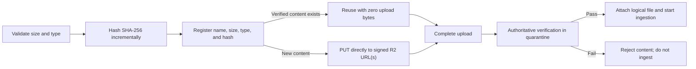

Every Plangrep upload surface uses one canonical flow. Your client validates and hashes each file before it sends bytes. Registration then returns either an organization-scoped verified content reference, which sends zero upload bytes, or signed direct-to-R2 upload instructions.



<Note>
  Each job allows up to **100 files** and **10 GB** of declared file bytes. Each file can be up to **2 GB**. Registration enforces these limits before new bytes are transferred.
</Note>

## Why hashing happens first

Calculate SHA-256 from the exact file bytes immediately after file selection and before registration.

- **Zero-byte reuse:** Plangrep can reuse matching verified content within your organization.
- **Transfer integrity:** Plangrep compares your declaration with a SHA-256 digest calculated from the stored object.
- **Signed checksums:** Direct PUT instructions include a signed `x-amz-checksum-sha256` header.
- **Stable retries:** The digest identifies the intended bytes independently of the filename.

In a browser, hash incrementally in a worker. Read bounded slices such as 4 MiB chunks instead of loading the full file into browser or WASM memory. Hash small files through the same worker path so every file follows the same contract.

<Warning>
  A client-provided hash is a declaration, not trusted proof. Plangrep independently streams and hashes the object before it can leave quarantine.
</Warning>

## Supported file types

The declared file extension and MIME type must agree. Plangrep accepts:

| File type | Extensions | Common MIME types |
|---|---|---|
| PDF | `.pdf` | `application/pdf` |
| Images | `.png`, `.jpg`, `.jpeg` | `image/png`, `image/jpeg` |
| Word | `.docx` | `application/vnd.openxmlformats-officedocument.wordprocessingml.document` |
| Excel | `.xls`, `.xlsx` | `application/vnd.ms-excel`, `application/vnd.openxmlformats-officedocument.spreadsheetml.sheet` |
| PowerPoint | `.pptx` | `application/vnd.openxmlformats-officedocument.presentationml.presentation` |
| CSV | `.csv` | `text/csv`, `application/csv` |
| Markdown | `.md`, `.markdown` | `text/markdown`, `text/plain` |
| Text | `.txt` | `text/plain` |
| JSON | `.json` | `application/json`, `text/json`, `text/plain` |

Do not send `classification`. Plangrep determines whether a file contains plans, specifications, documents, or mixed page families during preflight.

## Step 1: Register every file

Send declarations before file bytes:

```http
POST /api/open/v1/jobs/{jobId}/uploads
Authorization: Bearer {your_api_key}
Content-Type: application/json
```

```json
{
  "files": [
    {
      "fileName": "A101-floor-plan.pdf",
      "fileSize": 52428800,
      "contentType": "application/pdf",
      "sha256": "a3f1b2c4d5e6f7081920a1b2c3d4e5f6a7b8c9d0e1f2031415161718191a1b1c"
    }
  ]
}
```

`fileSize` must be the exact non-negative integer byte length. `sha256` must be the complete 64-character hexadecimal digest of those bytes.

## Step 2: Follow the returned branch

Inspect each item in `uploads` independently. A batch can contain reused, direct PUT, multipart, and skipped items.

| Response | What you do |
|---|---|
| `status: "reused"` | Send no file bytes. Save `documentId` for completion. |
| `uploadMode: "direct_put"` | PUT the complete file to `uploadUrl` with every returned `uploadHeaders` entry. |
| `uploadMode: "multipart"` | PUT each specified byte range to its part URL and save every response `ETag`. |
| `status: "skipped"` | Do not upload or complete that item. Inspect `skippedReason`. |

### Reused verified content

A reuse response contains `documentId`, `contentBlobId`, `status: "reused"`, and `requiresCompletion`. It intentionally has no signed URL or upload token.

Reuse is scoped to your organization. Registration does not reveal whether the same bytes exist in another organization. Different logical files can reuse one verified object while retaining their own filename, project, review, folder, and version semantics.

Include the reused `documentId` in completion when the job should process it. No bytes are uploaded again.

### Signed direct PUT

Files below the multipart threshold receive one signed R2 URL. Use the returned headers exactly as provided:

```bash
curl -X PUT "UPLOAD_URL" \
  -H "content-type: application/pdf" \
  -H "x-amz-checksum-sha256: BASE64_CHECKSUM_FROM_UPLOAD_HEADERS" \
  --data-binary @A101-floor-plan.pdf
```

`x-amz-checksum-sha256` is the base64-encoded SHA-256 checksum returned in `uploadHeaders`, not the hexadecimal registration value. When `checksumEnforced` is `true`, R2 rejects a request that omits or changes this signed header.

### Signed multipart upload

Files at or above 32 MiB receive `uploadMode: "multipart"`, a `multipartUploadId`, a target `partSize`, and a `parts` array. For every part:

1. Read local bytes from `startByte` through `endByteExclusive - 1`.
2. PUT that slice to `uploadUrl` with every returned `uploadHeaders` entry.
3. Record the response `ETag` with its `partNumber`.

Multipart responses currently set `checksumEnforced: false`. Plangrep still calculates the authoritative SHA-256 across the assembled R2 object during completion.

Signed URLs expire at `expiresAt`. Re-register the file if an instruction expires. Never store signed URLs for later reuse.

## Step 3: Complete and verify

After all required PUT requests succeed, complete the upload window:

```http
POST /api/open/v1/jobs/{jobId}/uploads/complete
Authorization: Bearer {your_api_key}
Content-Type: application/json
Idempotency-Key: {unique_completion_key}
```

For a batch containing reused, direct, and multipart content, send:

```json
{
  "documentIds": ["doc_reused", "doc_direct", "doc_multipart"],
  "directUploads": [
    { "documentId": "doc_direct", "uploadToken": "token-direct" }
  ],
  "multipartUploads": [
    {
      "documentId": "doc_multipart",
      "multipartUploadId": "multipart-id",
      "uploadToken": "token-multipart",
      "parts": [
        { "partNumber": 1, "etag": "\"etag-value-1\"" },
        { "partNumber": 2, "etag": "\"etag-value-2\"" }
      ]
    }
  ]
}
```

Reused documents appear only in `documentIds`. Newly transferred documents also need their matching direct or multipart completion record.

## What completion verifies

New objects remain quarantined until Plangrep verifies all of the following from the stored bytes:

- The authoritative byte count equals the registered `fileSize`.
- The authoritative SHA-256 equals the registered `sha256`.
- File magic and detected type agree with the declared extension and MIME type.
- The SHA-256 does not match the configured known-malware blocklist.

Only a verified, clean content object can be attached to the logical project or review file and passed to ingestion. A failure rejects the quarantined object and returns an error instead of starting processing.

<Tip>
  Use a unique `Idempotency-Key` for completion. If the response is lost, retry the same request with the same key.
</Tip>
