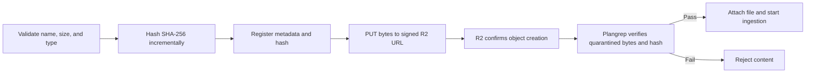

Every Plangrep upload uses one integrity path. Your client declares the file name, byte size, MIME type, and SHA-256, then sends the bytes directly to the returned signed R2 URL. Plangrep independently verifies the stored bytes before processing.



<Note>
  Each job allows up to **5,000 files** and **10 GiB** of declared file bytes. Each file can be up to **2 GiB**. Preflight also enforces **3,000 pages per PDF** and **50,000 prepared pages per job**.
</Note>

## Why the client sends a hash

A client-computed digest gives the registration a stable identity and lets Plangrep detect a transfer mismatch. Calculate it incrementally so large files never need to occupy one browser or WASM buffer.

The digest remains an untrusted declaration. Plangrep computes SHA-256 again while streaming the complete quarantined object. Only the verified server-computed digest becomes the canonical content identity.

## Supported file types

The declared file extension and MIME type must agree. Plangrep accepts:

| File type | Extensions | Common MIME types |
|---|---|---|
| PDF | `.pdf` | `application/pdf` |
| Images | `.png`, `.jpg`, `.jpeg` | `image/png`, `image/jpeg` |
| Word | `.docx` | `application/vnd.openxmlformats-officedocument.wordprocessingml.document` |
| Excel | `.xls`, `.xlsx` | `application/vnd.ms-excel`, `application/vnd.openxmlformats-officedocument.spreadsheetml.sheet` |
| PowerPoint | `.pptx` | `application/vnd.openxmlformats-officedocument.presentationml.presentation` |
| CSV | `.csv` | `text/csv`, `application/csv` |
| Markdown | `.md`, `.markdown` | `text/markdown`, `text/plain` |
| Text | `.txt` | `text/plain` |
| JSON | `.json` | `application/json`, `text/json`, `text/plain` |

Do not send `classification`. Plangrep determines plans, specifications, documents, or mixed page families during preflight.

## Step 1: Register the file

```http
POST /api/open/v1/jobs/{jobId}/uploads
Authorization: Bearer {your_api_key}
Content-Type: application/json
```

```json
{
  "files": [
    {
      "fileName": "A101-floor-plan.pdf",
      "fileSize": 52428800,
      "contentType": "application/pdf",
      "sha256": "a3f1b2c4d5e6f7081920a1b2c3d4e5f6a7b8c9d0e1f2031415161718191a1b1c"
    }
  ]
}
```

`fileSize` must equal the stored object's final byte count. `sha256` must be the lowercase 64-character digest of the exact bytes you upload.

## Step 2: Upload the bytes

For every accepted registration, PUT the complete file to `uploadUrl` and send every returned `uploadHeaders` entry exactly:

```bash
curl -X PUT "UPLOAD_URL" \
  -H "content-type: application/pdf" \
  --data-binary @A101-floor-plan.pdf
```

Signed URLs expire at `expiresAt`. Register a new upload if an instruction expires.

## Automatic verification and processing

There is no completion request. R2 notifies Plangrep after the complete object is stored. Plangrep then:

1. Confirms the object belongs to an active, unexpired registration.
2. Streams the complete object from quarantine.
3. Verifies the stored byte count against `fileSize`.
4. Computes the canonical SHA-256.
5. Checks file magic and detected type.
6. Checks the canonical digest against the configured malware blocklist.
7. Attaches clean content and starts ingestion.

Queue delivery is idempotent. Repeated storage notifications cannot create duplicate files or duplicate processing admission.

## Poll the job

Poll `GET /api/open/v1/jobs/{jobId}` after the PUT. The job advances automatically through upload verification, `preflighting`, and `processing`.
